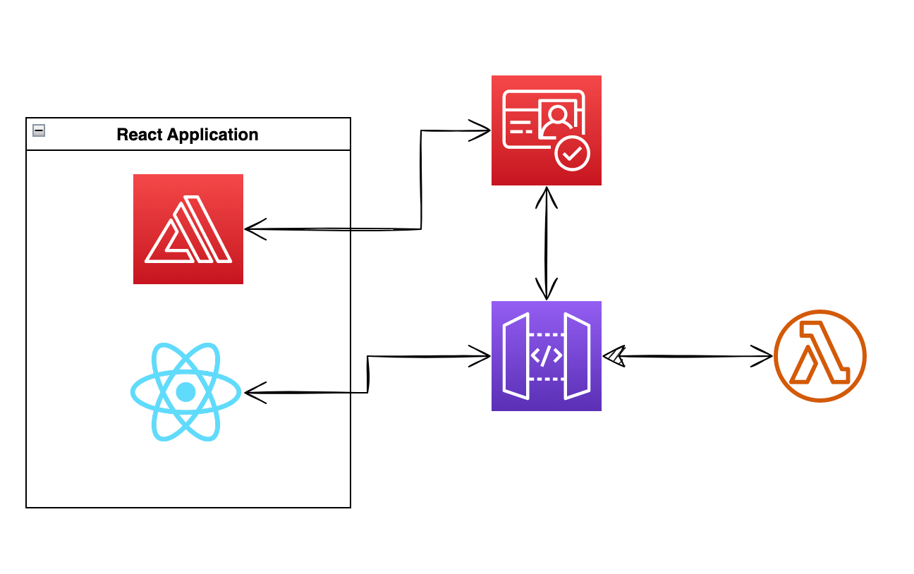

# Authentication in React with AWS Cognito and AmplifyGo

This example demonstrates how to use AWS Cognito for authentication in a React application. 
The application uses AWS Amplify to manage the authentication flow, and it uses ID tokens to authenticate with the backend.

## Microservice Architecture

As a backend, we use a simple microservice written in Go. The microservice uses AWS Cognito for authentication.

## Status

The project is in progress. 

