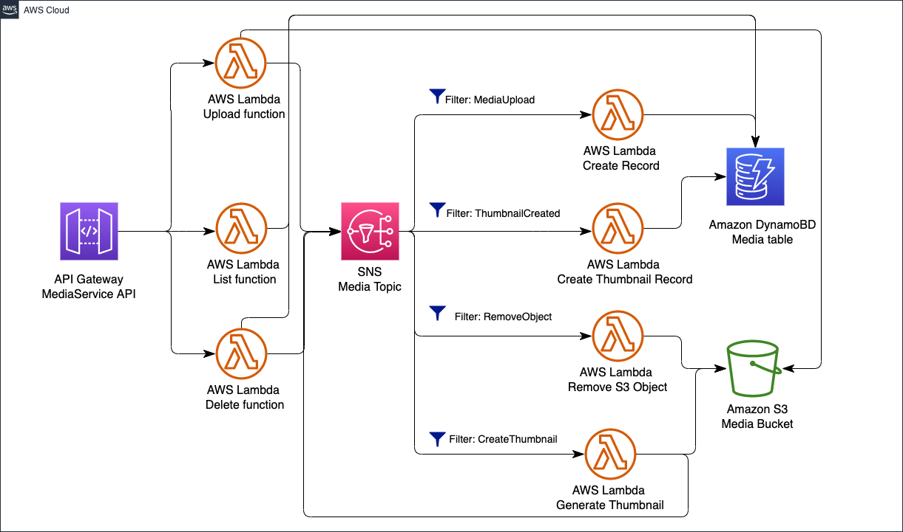

# Media microservice
This is an example of a media microservice. The microservice provides endpoints for uploading media content, getting media content and deleting media content. For images, the service creates a thumbnail.

DynamoDB is used for storing media information, and S3 is used for storing media content.

## Microservice Architecture

In this example, we use Lambda functions written in Go. API Gateway uses as a proxy in front of the application. The service has a persistence database, and Amazon SNS uses for internal communication.



Install the serverless CLI via NPM:
```shell
npm install -g serverless
````
Install the Serverless Prune Plugin

```shell
npm install --save-dev serverless-prune-plugin
```

Install IAM Roles Per Function Plugin
```shell
npm install --save-dev serverless-iam-roles-per-function
```
