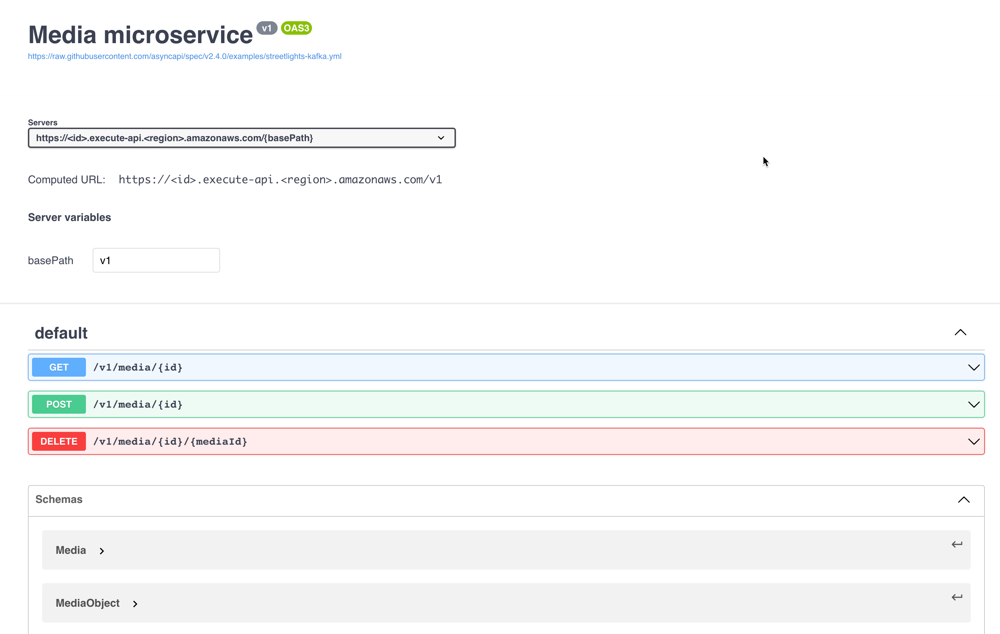
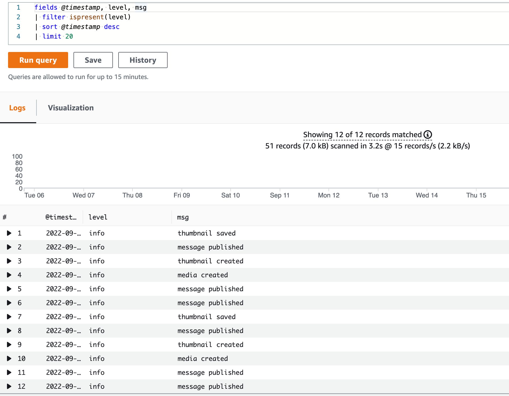

# Media microservice

This is an example of a media microservice. The microservice provides endpoints for uploading, getting and deleting
media content. For images, the service creates a thumbnail.

DynamoDB is used for storing media information, and S3 is used for storing media content.

## Microservice Architecture

In this example, we use Lambda functions written in Go. API Gateway uses as a proxy in front of the application. The
service has a persistence database, and Amazon SNS uses for internal communication.


## Install

Go into the project directory and install node modules:

```shell
npm install
```

Before we can deploy anything, we need to compile the functions

```shell
make build
```

To deploy your environment run the following command:

```shell
sls deploy
```

The deploy command should output a URL that you can access your microservice on.

## Usage

The microservice provides three API endpoints for clients.

- Upload product's media content
- Get the product's media content
- Delete the product's media content



## Logging

The service uses AWS CloudWatch for logging. CloudWatch has identified fields such as level, msg, service, etc. If we wanted to see only logs from the media microservice, we could use the following query:

```shell
fields @timestamp, level, msg
| filter ispresent(level)
| sort @timestamp desc
| limit 20
```



## Status

The project is in progress. The following features are planned:

- [ ] Add unit tests
- [ ] Integrate with AWS X-Ray