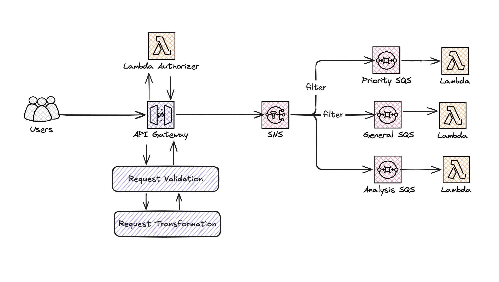

# AWS CDK Python Demo: Customer Support Ticket Routing Architecture

[](https://github.com/myarik/aws-cdk-python-demo)

This branch contains the AWS CDK Python implementation of the Customer Support Ticket Routing Service. The service
provides an API for creating and retrieving support tickets, with routing logic based on customer tier (general or gold).

## Table of Contents

- [Prerequisites](#prerequisites)
- [Service Schema](#service-schema)
- [API Endpoints](#available-endpoints)
- [Installation](#installation)

## Prerequisites

- Python 3.12+
- AWS CLI configured with appropriate permissions
- Node.js and npm (for AWS CDK)
- UV for Python dependency management

## Service Architecture



The architecture consists of the following components:

- **API Gateway**: Serves as the entry point for the service, providing REST API endpoints for ticket creation (_POST
  /tickets_) and retrieval (_GET /tickets_).
- **Lambda Authorizer**: A Lambda function that authenticates and authorizes requests based on a token provided in the
  `Token`
  header. It determines the user's tier (general or gold) and passes this information to the backend.
- **SNS Topic**: An SNS topic (TicketRouting) that receives ticket creation requests.
- **SQS Queues**: Three SQS queues:
    - AnalyticsQueue: Receives all tickets for analytics processing.
    - PriorityTicketsQueue: Receives tickets from gold tier customers.
    - GeneralTicketsQueue: Receives tickets from general tier customers.

- Lambda Processors: Three Lambda functions that process messages from the SQS queues:
    - analytics-processor: Processes all tickets for analytics.
    - priority-channel-processor: Processes tickets from the PriorityTicketsQueue.
    - general-channel-processor: Processes tickets from the GeneralTicketsQueue.

- Lambda Functions:
    - user-tickets: Retrieves user tickets.
    - authorizer: Authorizes the user.

## API Endpoints

The API provides the following endpoints:

- GET /tickets - Retrieves tickets for the authenticated user. Requires a valid Token in the header.
- POST /tickets: Creates a new ticket. Requires a valid Token in the header and a JSON payload with the following schema:

```json
{
  "type": "string",
  "message": "string"
}
```

## Installation

Clone the repository:

```bash
git clone --branch lambda-url git@github.com:myarik/aws_cdk_python_demo.git 
cd aws-cdk-python-demo
```

Install the dependencies:

```bash
make dev
```

Deploy the stack:

```bash
make deploy
```
